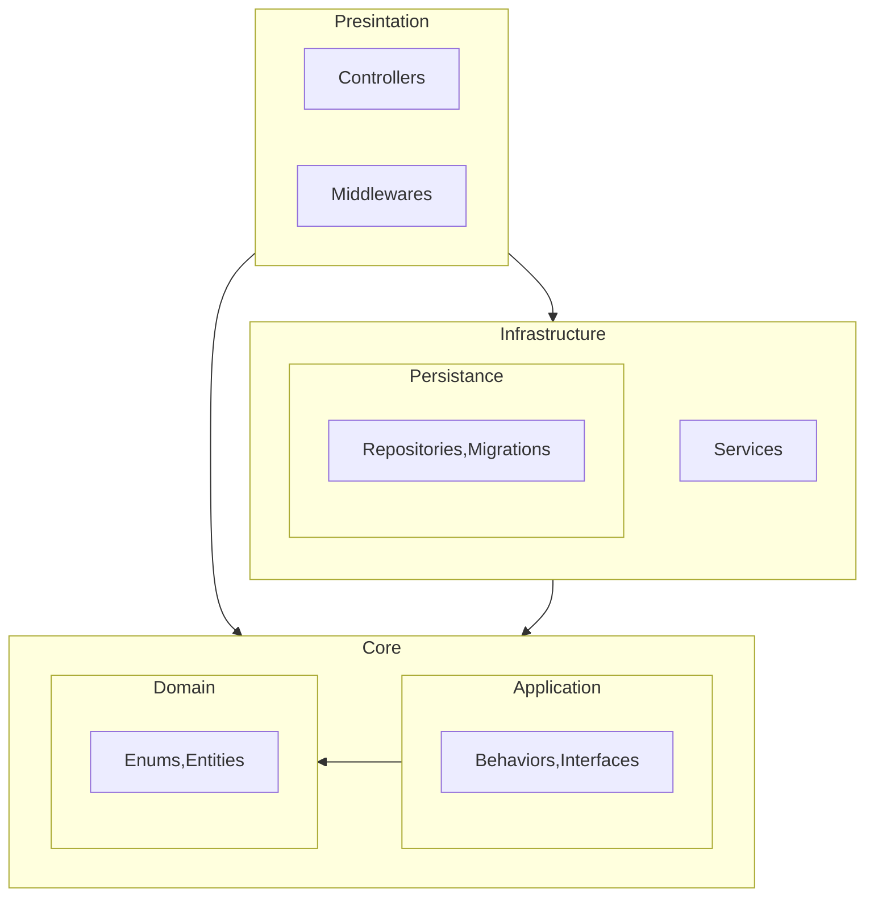

```mermaid
graph
    Presintation --> Core
    Presintation --> Infrastructure
    Infrastructure --> Core
    
    subgraph Presintation
        Controllers
        Middlewares
    end
    subgraph Core
        direction RL
        Application --> Domain
        subgraph Application
            Behaviors,Interfaces
        end
        subgraph Domain
            Enums,Entities
        end
    end
    subgraph Infrastructure
    direction BT
    Services
        subgraph Persistance
        Repositories,Migrations
        end
    end
```

https://deriglazoff.github.io/Geolocation/src/Geolocation.Client/swagger.html
